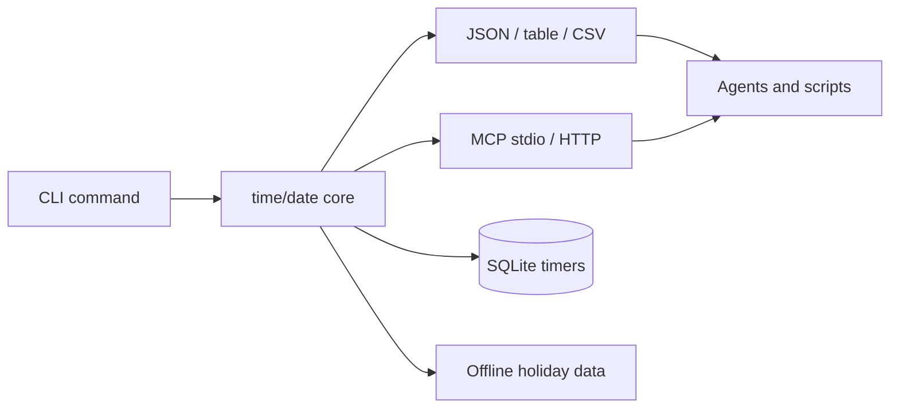

# time-keep

`time-keep` is a local-first Rust CLI and MCP server that gives agents reliable
time context without reaching for hosted auth, cloud sync, network time APIs, or
live holiday APIs.

The contract is intentionally boring:

- JSON is the default output for agents and scripts.
- Table and CSV output are available for humans and exports.
- IANA timezone names are required for timezone-aware operations.
- Calendar and date math use absolute inputs and deterministic rules.
- Timers persist locally in SQLite.
- Holiday data is offline and bounded to `2000..=2030`.
- MCP stdio and streamable HTTP expose the same workflows to agents.

## Core Commands

```bash
time-keep now --tz UTC --tz Europe/Madrid
time-keep convert 2026-06-18T12:00:00Z --from UTC --to Europe/Madrid
time-keep calc add 2026-01-31 1 month
time-keep biz between 2026-12-24 2026-12-28 --country US --skip-holidays
time-keep timer set q3-planning 2026-07-01T17:00:00-04:00 --tag work
time-keep server start --transport stdio
time-keep server start --transport streamable-http --http-port 8769
```

## Architecture



Start with the [Quickstart](getting-started/quickstart.md), then review
[MCP Reference](reference/mcp.md) and [Timers](reference/timers.md) for
agent-facing contracts.
